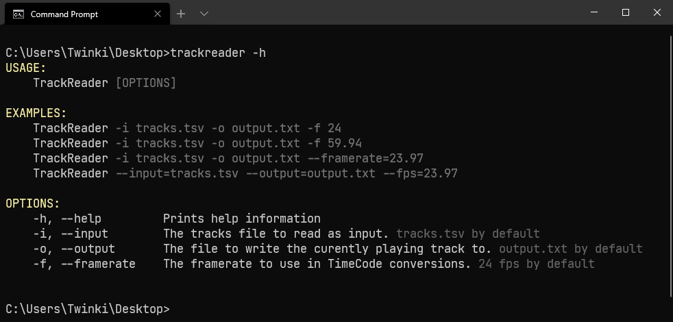

## Usage


- TrackReader reads a list of tracks from a specified tsv or csv file given by `input`
- After compiling a list of tracks, it'll write the tracks in-order to the given `output`
- Each track needs a start-time in [timecode format](https://www.mediacollege.com/video/editing/timecode/), specified by the `Time` column
- The app will read the list, determine the run-time for each track based on the `Time` column and specified `Framerate` passed when starting the cli, 
  and write to the `output` in order according to the `Number` column and track run-time. To be more specific, when the track run-time has passed, the next track in the list will be written to the `output`, 
  and after that track run-time has passed, the track following will be 'played'
- You can manually control the current track with customizable [global hotkeys](#hotkeys)

## Demo

## Config

### Hotkeys
Hotkeys can be set to key combinations or single key presses in appsettings.json
The syntax is the name of the key found in the [windows forms keys enum.](https://docs.microsoft.com/en-us/dotnet/api/system.windows.forms.keys)

For example, `"Next": "Alt+Control+N"` would skip to the next track when holding `Alt+Control` key modifiers, and pressing `N`. `"Previous": "P"` would go to the previous track when pressing `P`.

### appsettings.json
These settings below will use the right arrow key and left arrow key to skip to the next or previous track
```json
{
  "Hotkeys": {
    "Next": "Right",
    "Previous": "Left"
  }
}
```
